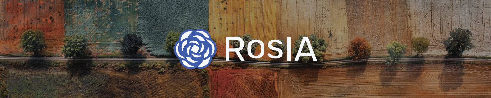
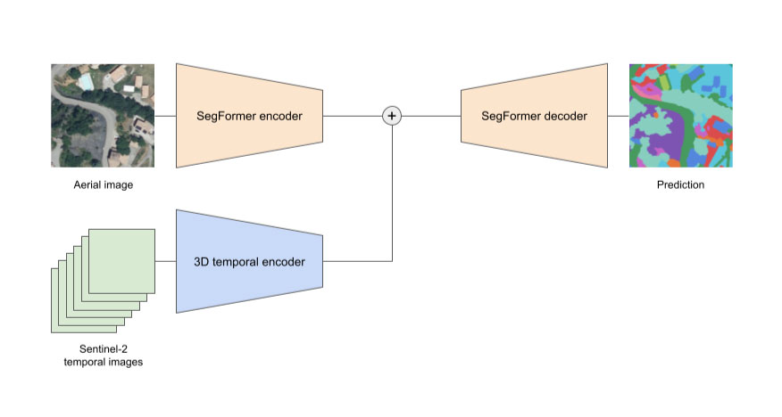

# 🛰️ FLAIR #2



The challenge involves a semantic segmentation task focusing on land cover description using multimodal remote sensing earth observation data. Participants will explore heterogeneous data fusion methods in a real-world scenario. Upon registration, access is granted to a dataset containing 70,000+ aerial imagery patches with pixel-based annotations and 50,000 Sentinel-2 satellite acquisitions.

This project was made possible by our compute partners [2CRSi](https://2crsi.com/) and [NVIDIA](https://www.nvidia.com/).

## 🏆 Challenge ranking
The score of the challenge was the mIoU.  
Our solution was the 8th one (out of 30 teams) with a mIoU equal to 0.62610 🎉.

The podium:  
🥇 strakajk - 0.64130  
🥈 Breizhchess - 0.63550  
🥉 qwerty64 - 0.63510  

## 🖼️ Result example

Aerial input image | Multi-class label | Multi-class pred
:--------------------:|:--------------------:|:--------------------:|
 |  | 

View more results on the [WandB project](https://wandb.ai/association-rosia/flair-2).

## 🏛️ Model architecture



## #️⃣ Command lines

### Launch a training

```bash
python src/models/train_model.py <hyperparams args>
```

### Create a submission

```bash
python src/models/predict_model.py -n {model.ckpt}
```

## 🔬 References

Chen, L. C., Papandreou, G., Schroff, F., & Adam, H. (2017). Rethinking atrous convolution for semantic image segmentation. arXiv preprint arXiv:1706.05587.

Garioud, A., De Wit, A., Poupée, M., Valette, M., Giordano, S., & Wattrelos, B. (2023). FLAIR# 2: textural and temporal information for semantic segmentation from multi-source optical imagery. arXiv preprint arXiv:2305.14467.

Xie, E., Wang, W., Yu, Z., Anandkumar, A., Alvarez, J. M., & Luo, P. (2021). SegFormer: Simple and efficient design for semantic segmentation with transformers. Advances in Neural Information Processing Systems, 34, 12077-12090.

## 📝 Citing

```
@misc{RebergaUrgell:2023,
  Author = {Louis Reberga and Baptiste Urgell},
  Title = {FLAIR #2},
  Year = {2023},
  Publisher = {GitHub},
  Journal = {GitHub repository},
  Howpublished = {\url{https://github.com/association-rosia/flair-2}}
}
```

## 🛡️ License

Project is distributed under [MIT License](https://github.com/association-rosia/flair-2/blob/main/LICENSE)

## 👨🏻‍💻 Contributors <a name="contributors"></a>

Louis
REBERGA <a href="https://twitter.com/rbrgAlou"></a> <a href="https://www.linkedin.com/in/louisreberga/"></a> <a href="louis.reberga@gmail.com"></a>

Baptiste
URGELL <a href="https://twitter.com/Baptiste2108"></a> <a href="https://www.linkedin.com/in/baptiste-urgell/"></a> <a href="baptiste.u@gmail.com"></a> 
