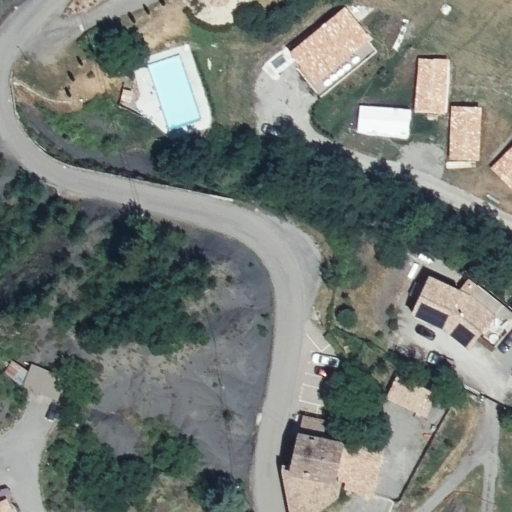
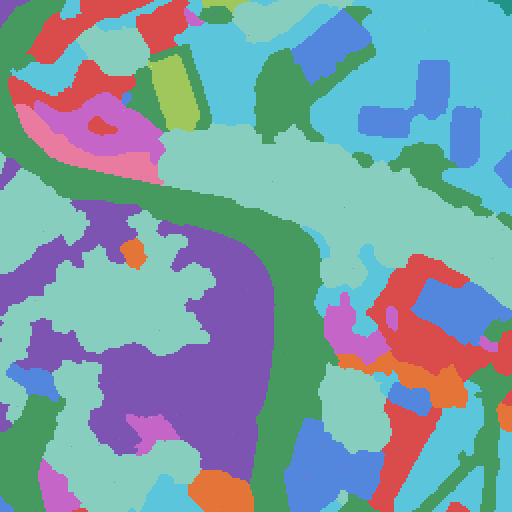
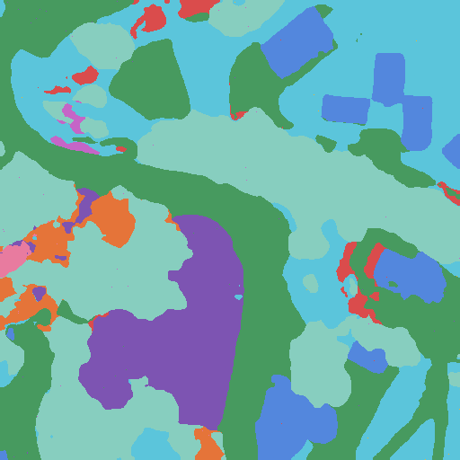

# 🛰️ FLAIR #2


This project was made possible by our compute partners [2CRSI](https://2crsi.com/)
and [NVIDIA](https://www.nvidia.com/).

## 📋 Table of content
1. [🏁 Getting started](#start)
2. [⚙️ Train a model](#train)
3. [📝 Create a submission](#submission)
4. [🖼️ Results example](#results-example)
5. [🏛️ Multi-resolution and multi-temporal model architecture](#model-architecture)
6. [🔬 References](#references)
7. [📝 Citing](#citing)
8. [🛡️ License](#license)
9. [👨🏻‍💻 Contributors](#contributors)

## 🏁 Getting started <a name="start"></a>

1 - Create the conda environment:

```bash
conda env create -f environment.yml
```

2 - Activate the conda environment:

```bash
conda activate flair-2-env
```

3 - Install PyTorch and CUDA libraries:

```bash
conda install pytorch torchvision pytorch-cuda=11.8 -c pytorch -c nvidia
```

## ⚙️ Train a model <a name="train"></a>

1 - Move to the project folder:

```bash
cd flair-2
```

2 - Activate the conda environment:

```bash
conda activate flair-2-env
```

3 - Launch the model training in background:

```bash
nohup python src/models/train_model.py <hyperparams args> </dev/null &>/dev/null &
```

(Bonus) - Kill the background process:

```bash
pkill -f 'python src/models/train_model.py'
```

## 📝 Create a submission <a name="submission"></a>

1 - Move to the project folder:

```bash
cd flair-2
```

3 - Activate the conda environment:

```bash
conda activate flair-2-env
```

4 - Launch the model inference:

```bash
python src/models/predict_model.py -n {model.ckpt}
```

## 🖼️ Results example <a name="results-example"></a>

Aerial input image | Multi-class label | Multi-class pred
:--------------------:|:--------------------:|:--------------------:|
 |  | 

## 🏛️ Multi-resolution and multi-temporal model architecture <a name="model-architecture"></a>

## 🔬 References <a name="references"></a>

## 📝 Citing <a name="citing"></a>

## 🛡️ License <a name="license"></a>

Project is distributed under [MIT License](https://github.com/association-rosia/flair-2/blob/main/LICENSE)

## 👨🏻‍💻 Contributors <a name="contributors"></a>

Louis
REBERGA <a href="https://twitter.com/rbrgAlou"></a> <a href="https://www.linkedin.com/in/louisreberga/"></a> <a href="louis.reberga@gmail.com"></a>

Baptiste
URGELL <a href="https://twitter.com/Baptiste2108"></a> <a href="https://www.linkedin.com/in/baptiste-urgell/"></a> <a href="baptiste.u@gmail.com"></a> 
